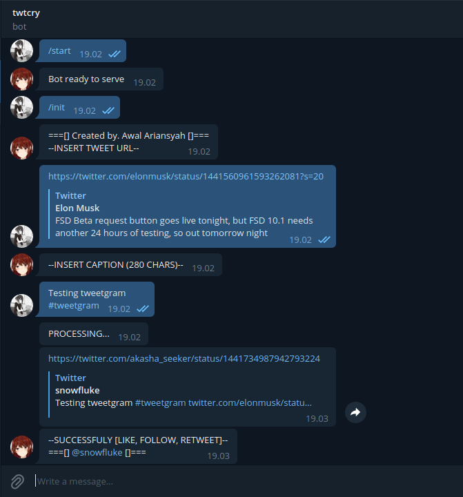
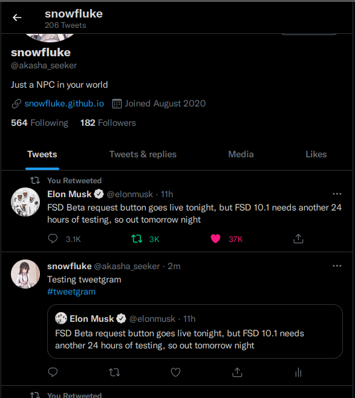

# tweetgram
Telegram bot for Twitter Task Airdrop (Like, Retweet, Follow, Quote Retweet)

# Demo

# Configuration
Enter your Twitter API Credential and Telegram BOT Token at **config.json**

# How to get Twitter API Credential
1. Go to Twitter Dev Portal https://developer.twitter.com/en/portal/dashboard
2. Sign up as Hobyist > Making A bot
3. Generate API Key and Access Token
4. Make sure you set the permission to Read and Write
5. See Tutotial video https://www.youtube.com/watch?v=vlvtqp44xoQ

# How to get Telegram Bot Token
1. Chat to BotFather https://t.me/BotFather
2. Start and make /newbot
3. Name it and give it an username with suffix \_bot
4. Get the Bot Token

# Deploying Bot
You can use heroku, make sure you clone this repo to your Github account repositories.\
See Tutorial here https://www.youtube.com/watch?v=BPvg9bndP1U, it's the same for Telegram Bot.

Worker: node main.js

# Using Bot
1. Go to search bar in your telegram
2. Type your Bot Username

# Author
Awal Ariansyah 2021 - https://snowfluke.github.io/
